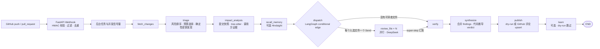

# code-review-agent

基于 **LangGraph + DeepSeek API** 的 GitHub 自动代码审查 Agent：有新的 push（或 Pull Request）时，自动审查改动并把结果评论回 GitHub。

> 想了解它是怎么设计的、用了哪些技术原理，以及 LangGraph 的原理与用法，见 [docs/DESIGN.md](docs/DESIGN.md)。

## 工作流程



**可单独查看 / 下载的详细流程图**（含 LangGraph `Send` 并行扇出、super-step 汇聚与状态节点）：



[SVG 流程图](docs/agent-workflow.svg) · [PNG 预览](docs/agent-workflow.png) · [可编辑 Mermaid 源码（README 内）](README.md#工作流程) · [本地修改、推送与触发演示指南](docs/DEMO.md)

### 一次运行的 LangGraph 状态流

图的入口只接收 `target`（仓库、commit SHA、可选 PR 编号）；`fetch_changes` 通过依赖注入的 GitHub client 取数据。后续每个节点返回**局部状态更新**，不是重新构造整份状态。

| 阶段 | 读取 → 写入 | 图控制 / 失败行为 |
|---|---|---|
| `fetch_changes` | `target` → `commit_message`、`files`、`changed_paths` | GitHub API 分页；commit message 先脱敏。`changed_paths` 保留全部改动路径，供影响分析判定调用方文件是否也被改动 |
| `triage` | `files` → 预算内候选 `files`、`skipped`、可选 `file_reviews` | 敏感文件由规则直接产生 finding、绝不送模型；其余文件按风险和字符预算排序。安全规则 finding 通过追加型 `file_reviews` 进入下游 |
| `impact_analysis` | `target`、候选文件、原始 `changed_paths` → `impact`、`impact_summary` | 可关闭；下载或解析失败时优雅降级为空证据。tree-sitter 默认在隔离子进程运行 |
| `recall_memory` | 仓库、候选路径、commit message → `memory`、`memory_count` | Hindsight 可选；不可用不阻断审查，召回内容作为不可信背景 |
| `dispatch` | 候选文件 + 共用上下文 → `Send("review_file", FileTask)` 列表 | 条件边动态扇出；无候选文件则直接路由到 `verify`，不创建空的模型任务 |
| `review_file × N` | 单文件 diff + 对应影响证据 → `file_reviews`、`errors` | 同一 super-step 并行；每个任务只拿本文件所需 payload。两字段使用 `operator.add` reducer 汇总并发写入 |
| `verify` | `file_reviews` → `verified_reviews`、`verify_log` | 按严重度预算验证模型 critical/major/minor；反驳则删除，不确定则降一级，失败保留原发现。P3/nit 只在汇总中展示、不发逐条行内评论 |
| `synthesize` | `_final_reviews(state)` → `verdict`、`summary` | `_final_reviews` 优先取 `verified_reviews`，否则取 `file_reviews`；严重度到结论由代码确定，模型只写摘要 |
| `publish` | 最终 reviews 与目标 → `report`、`posted` | `dry_run` 只渲染；GitHub 发布执行 upsert 与评论去重；全部文件调用失败时不发布误导性的“无问题” |
| `learn` | 仓库与可信反馈 → Hindsight 记忆 | 可选；dry-run 跳过；失败不影响审查结果 |

#### LangGraph 的关键机制

1. **StateGraph + TypedDict**：`ReviewState` 是图的共享状态 schema。节点只返回本阶段变更的字段；节点之间通过状态而不是共享可变对象传递结果。
2. **Conditional edge + Send 动态扇出**：`recall_memory` 后的 `dispatch` 为每个候选文件返回一个 `Send`，由 LangGraph 把多个 `review_file` 任务放在同一个 super-step 并行执行；全部结束后再进入 `verify`（扇入）。
3. **Reducer 定义并发合并语义**：`file_reviews`、`errors` 标注 `operator.add`，同一 super-step 的多个分支可以安全追加结果；无 reducer 的字段使用覆盖语义。
4. **为什么验证结果用另一个 state key**：`file_reviews` 是追加 reducer。若 `verify` 把过滤后的完整列表写回同一 key，结果会追加到原列表，而非替换，因此改写到 `verified_reviews`；下游统一通过 `_final_reviews()` 选择最终版本。
5. **依赖注入**：GitHub、LLM、快照、Hindsight、缓存都从 `build_graph()` 注入；单元测试用 fake 实现替换，不需要真实网络或密钥。
6. **并发上限**：`graph.invoke(..., config={"max_concurrency": settings.llm_concurrency})` 限制图级并发；Webhook 外层还有全局 review semaphore，分别控制单次图内 LLM 并发和服务同时处理的 review 数。

节点实现与 LangGraph 原理详解（State、Node、Edge、super-step、reducer、Send、checkpoint、容错）见 [docs/DESIGN.md](docs/DESIGN.md) 第 3–5、15–25 节。

| 节点 | 作用 |
|---|---|
| `fetch_changes` | 通过 GitHub API 读取 commit / PR 的变更文件（分页取全，最多 `MAX_COMMIT_PAGES` 页）与 diff |
| `triage` | 跳过删除文件、锁文件、依赖/产物目录、二进制；**按风险排序**（认证、权限、SQL、支付、迁移等路径优先）并在总字符预算内挑选；敏感文件（`.env`、私钥等）不送模型，直接给出确定性告警 |
| `impact_analysis` | （默认开启）下载被审查提交时的仓库快照，用 tree-sitter 找出 diff 触及的函数/类，再在整个仓库里找它们的**调用方和测试**，把调用方的真实代码片段作为证据交给审查模型。详见下文 |
| `recall_memory` | （可选）从 Hindsight 召回该仓库的约定与历史反馈，作为不可信背景附加到提示词 |
| `review_file` | 用 LangGraph `Send` 对每个文件并行调用 DeepSeek；大 diff 分块（超长时按 hunk 保留首尾，不只看开头）；送模型前对疑似密钥打码，并对新增行做确定性密钥扫描；输出结构化 findings；相同输入的结果会缓存（`REVIEW_CACHE`） |
| `verify` | 二次验证：按优先级预算对模型 critical/major/minor 发现，让模型在只看代码证据的前提下尝试**反驳**。被反驳的剔除，不确定则降一级（minor → P3/nit），调用失败保留原样；规则发现不参与。每条决定都会记录（`--explain` 可查看），最多 `VERIFY_MAX_FINDINGS` 条 |
| `synthesize` | 合并、去重、排序；**结论由代码根据严重度确定**（不由模型决定）；再根据脱敏 diff、文件范围、调用方证据和 findings 生成分节总结：变更概述、影响范围、正向影响、风险/负向影响、优先修复项 |
| `publish` | push → 提交评论（commit comment，同一提交重复审查时更新而非新增）；PR → 行内评论按已有评论去重 + 一条汇总评论（更新而非新增） |
| `learn` | （可选）把本次审查沉淀到 Hindsight；`--post` 之外的试跑不写记忆 |

设计要点：

- **diff 带新文件行号**：模型只能把问题定位到真实存在的新增行；不存在的行号会被清除，不会发布错位评论。
- **提示注入防护**：commit message 和 diff 都视为不可信数据放入标签内；输出做净化（中和 `@提及`、远程图片、危险 HTML）。
- **失败不误导**：所有文件的模型调用都失败时不会发布“没有问题”的评论；部分失败会在评论里注明结果可能不完整。
- **成本控制**：文件数、单文件字符数、分块大小、每次 push 最多审查的提交数、并发数均可配置。
- **安全边界**：Webhook 强制 HMAC 签名校验；可用 `ALLOWED_REPOS` 白名单限制仓库；忽略机器人触发的事件、草稿 PR、合并提交、已删除分支；对重复投递去重。
- **评论降噪与分级**：severity 映射到 P0（critical）/P1（major）/P2（minor）/P3（nit）；finding 按优先级分组。P3 只留在汇总，不创建行内线程；minor 及以上会受上限约束做反驳式复核。额外复核调用有成本，详见配置项。

## 快速开始

```powershell
cd code-review-agent
python -m venv .venv
.\.venv\Scripts\python.exe -m pip install -e ".[dev]"
Copy-Item .env.example .env      # 然后编辑 .env，填入密钥
.\.venv\Scripts\python.exe -m pytest      # 单元测试，无需密钥/网络
```

`.env` 已被 `.gitignore` 忽略；不要把任何密钥提交到仓库。

### 1. 本地试跑（默认只输出，不发布）

```powershell
.\.venv\Scripts\python.exe -m code_review_agent review --repo owner/name --sha <提交 SHA>
# 审查 PR：再加 --pr 12（--sha 为 PR 的 head 提交）
# 确认效果后才真正发布评论：加 --post
```

### 2. 接入 GitHub 自动审查

1. 在 `.env` 配置 `DEEPSEEK_API_KEY`、`GITHUB_TOKEN`、`GITHUB_WEBHOOK_SECRET`（建议同时设置 `ALLOWED_REPOS`）。
2. `GITHUB_TOKEN` 建议使用仅授权目标仓库的 fine-grained token：`Contents: Read and write`（提交评论）、`Pull requests: Read and write`（PR 审查）、`Metadata: Read`。
3. 启动服务：`.\.venv\Scripts\python.exe -m code_review_agent serve`（默认 `127.0.0.1:8080`）。
4. 让 GitHub 能访问该地址（本地开发可用 `ngrok`/`cloudflared` 等隧道；生产环境放在 HTTPS 反向代理之后）。
5. 在仓库 **Settings → Webhooks → Add webhook**：
   - Payload URL：`https://<你的域名>/webhook/github`
   - Content type：`application/json`
   - Secret：与 `GITHUB_WEBHOOK_SECRET` 相同
   - 事件：与 `REVIEW_EVENTS` 一致（默认 **Push**；若改为 `pull_request` 选 **Pull requests**）。同时开启两种会对同一改动重复审查。

## 影响面分析（理解整个仓库，而不只是 diff）

只看 diff 回答不了“还会破坏什么”。开启后（默认开启，`IMPACT_ANALYSIS=false` 关闭），每次审查会：

1. 用 GitHub API 下载被审查提交的仓库压缩包（按提交缓存在 `STATE_DIR/snapshots`），只解压源码文件；解压防路径穿越、链接、压缩炸弹，**不执行仓库中的任何代码**。
2. 用 tree-sitter（Python、JavaScript/TypeScript/TSX、Java）解析被改文件，把 diff 映射到具体的函数/类，判断是**签名/声明变更**、**函数体变更**还是**被移除/改名**；全新的符号不分析（没有“旧调用方”）。
3. 在整个仓库里按名字找调用方/导入方/相关测试，标注调用方所在文件**是否随本次改动一起修改**。这正是“改了签名却没改调用方”类问题的线索。
   同名符号用**导入关系**消歧：调用方导入了被改文件（Java 为同包）是强证据；调用方自己定义了同名符号，或导入的是**另一个**定义了该名字的文件，则判为“调用的是别的符号”，只计数、**不展示**给模型。
4. 把调用方的代码片段（先脱敏）作为证据交给模型；模型只有在证据显示调用方确实不再兼容时才报告，并必须引用 `path:line`。报告里会多一节“影响面”概述。

实现上，tree-sitter 的 Python 层每碰一个节点就创建一个对象，遍历整棵树比解析本身还慢。所以改用原生**查询**只取候选节点（按名字过滤的标识符、定义节点），同一个文件只解析一次，并先用整词正则预筛文件。在 Django（约 3000 个文件）上，最坏情形（`render` 这类高频名字）的端到端耗时由约 3.1–4.3 秒降到约 1.3–1.8 秒；在 5 个真实仓库、4015 个文件上与旧的逐节点遍历实现逐字段对比，定义完全一致，引用只在排序上有差异。

限制（请知悉）：

- 匹配是**按名字**的，不做类型解析：导入关系能消掉大部分同名误连，但做不到完全消除（没有导入线索时记为“未知”，仍会展示）；路径别名（`@/`）、命名空间包、再导出、动态调用、反射、跨仓库依赖找不到。过于通用的方法名（`get`、`run` 等）直接跳过。
- 只支持上述语言；其他语言的文件照常审查，只是没有影响面证据。
- 有时间/文件数预算（`IMPACT_TIME_BUDGET_SECONDS`、`IMPACT_MAX_PARSE_FILES`），超出时证据会标注“可能不完整”。
- **隐私**：仓库源码只会下载到本机分析；发送给 DeepSeek 的只有 diff 和调用方的短代码片段。若不希望仓库其他代码的片段离开本机，请关闭。
- **进程隔离**：tree-sitter 是原生代码，且解析的是不可信文件，因此分析默认在独立子进程里跑（`IMPACT_ISOLATED`），崩溃或卡死只会让这次审查少一份证据，不会拖垮服务。

## 评测（用数据证明改进有效）

`eval` 命令在内置的「种入缺陷」用例上跑真实的审查流程（只调用 DeepSeek，不访问 GitHub、不发布评论），统计召回和误报：

```powershell
.\.venv\Scripts\python.exe -m code_review_agent eval --list
.\.venv\Scripts\python.exe -m code_review_agent eval --runs 2                       # 完整流程
.\.venv\Scripts\python.exe -m code_review_agent eval --runs 2 --no-impact --no-verify  # 基线，用于对比
```

用例分三类：`cross_file`（破坏发生在未改动的文件里，必须点名具体调用方才算命中）、`local`（diff 内可见的缺陷）、`clean`（不应报告的改动，包括“签名变了但调用方已同步”“新增带默认值的参数”）。结果保存在 `STATE_DIR/evals/`。用例规模很小，结果只能说明趋势，不是统计显著的基准；请结合自己仓库的真实提交补充用例（用例定义在 `src/code_review_agent/evaluation.py`）。

### 实测结果（2026-10）

条件：`deepseek-chat`（temperature 0.2），12 个用例，每个用例跑 3 次（每种配置 36 次审查），`REVIEW_CACHE=false`，未启用 Hindsight 记忆。三种配置在同一份代码上依次运行：

- **A 基线**：`--no-impact --no-verify`，只看 diff
- **B 影响面分析**：`--no-verify`
- **C 完整流程**：影响面分析 + 二次验证（默认）

| 配置 | 跨文件缺陷召回 | 局部缺陷召回 | 误报（major 及以上） | 精确率 |
|---|---|---|---|---|
| A 基线 | 0/12 | 6/6 | 18 | 25% |
| B 影响面分析 | 12/12 | 6/6 | 1 | 95% |
| C 完整流程 | 12/12 | 6/6 | 0 | 100% |

“命中/误报”按用例拆开（每格为 3 次运行合计，`-` 表示该用例不应有任何发现）：

| 用例 | 类别 | A 基线 | B 影响面 | C 完整 |
|---|---|---|---|---|
| `py_signature_break` | cross_file | 0/3，误报 3 | 3/3，误报 1 | 3/3，误报 0 |
| `py_removed_function` | cross_file | 0/3，误报 0 | 3/3，误报 0 | 3/3，误报 0 |
| `py_return_semantics` | cross_file | 0/3，误报 3 | 3/3，误报 0 | 3/3，误报 0 |
| `ts_signature_break` | cross_file | 0/3，误报 3 | 3/3，误报 0 | 3/3，误报 0 |
| `py_sql_injection` | local | 3/3，误报 0 | 3/3，误报 0 | 3/3，误报 0 |
| `py_hardcoded_token` | local | 3/3，误报 0 | 3/3，误报 0 | 3/3，误报 0 |
| `py_clean_refactor` | clean | 误报 0 | 误报 0 | 误报 0 |
| `py_signature_change_callers_updated` | clean | 误报 3 | 误报 0 | 误报 0 |
| `py_compatible_signature_change` | clean | 误报 0 | 误报 0 | 误报 0 |
| `py_same_name_unrelated` | clean | 误报 3 | 误报 0 | 误报 0 |
| `ts_same_name_unrelated` | clean | 误报 3 | 误报 0 | 误报 0 |
| `py_clean_internal_change` | clean | 误报 0 | 误报 0 | 误报 0 |

怎么理解这些数字：

- **召回的提升来自影响面分析。** 基线只能泛泛地说“可能影响调用方”，点不出是哪一个，所以按“必须点名具体调用方”的标准跨文件召回为 0；有了调用方的代码证据后，三种跨文件缺陷（改签名、改名/移除、改返回值语义，Python 与 TypeScript）都能被点名。局部缺陷（SQL 注入、硬编码令牌）在三种配置下都能发现，说明新增的步骤没有损害原有能力。
- **基线的 18 条误报**主要来自没有证据时的猜测：对“调用方已同步更新”“另一个同名函数”这类并不会出问题的改动，也报“新增必填参数会破坏调用方”。
- **二次验证的作用比表面上小。** C 档的 20 次验证里，18 次“证实”、2 次“无法确认”并降级（都在 `ts_same_name_unrelated`，major 降为 minor，否则会成为误报），**没有剔除任何一条**。B 档那 1 条误报出现在 `py_signature_break` 的某一次运行里，C 档没有再出现，属于运行间的随机波动，不能算作验证的功劳。验证的价值是兜底，而不是主要的质量来源。
- **验证不能纠正有误导性的证据。** 开发过程中，两个“同名无关”用例在只靠名字匹配时各出现过误报：模型把另一个同名函数的调用方当成被破坏的调用方，二次验证还“确认”了它。真正修复它的是导入关系消歧（调用方导入的是另一个文件里的同名函数时，不再向模型展示），而不是验证。

局限：

- 样本很小，且用例是为暴露上述问题而写的（包括“同名无关”这两个），评测集与优化互相影响，数字只能说明趋势，不要当作对真实仓库的保证。
- 每种配置只有 3 次重复，没有做置信区间；B 档的 1 条误报与 C 档的 0 条误报差异在波动范围内。
- 只覆盖 Python 和 TypeScript 的函数签名/语义变更，没有覆盖 Java、类/接口变更、动态调用等场景。
- 命中判定是对发现文本的正则匹配（要求点名调用方），偏严格；换用更宽松的标准，基线的召回会更高。
- 本次评测在 Windows 上运行，评测结果保存在 `STATE_DIR/evals/`，可用相同命令复现：`eval --runs 3`、`eval --runs 3 --no-verify`、`eval --runs 3 --no-impact --no-verify`。

## 长期记忆（Hindsight，可选）

接入 [Hindsight](https://github.com/vectorize-io/hindsight) 后，Agent 对每个仓库（独立 memory bank：`cra-<owner>--<repo>`）记住并召回：

- 仓库约定：从**默认分支**读取 `MEMORY_CONVENTION_FILES`（如 `AGENTS.md`、`CONTRIBUTING.md`）。
- 维护者反馈：审查评论上的 +1 / -1 反应，只采信仓库所有者、token 所有者和 `TRUSTED_FEEDBACK_USERS` 的反应。

用法：

```powershell
# 1. 启动 Hindsight（需要它自己的 LLM 配置；DeepSeek 等 OpenAI 兼容端点是否可用请先自行验证）
docker run -p 8888:8888 -p 9999:9999 -e HINDSIGHT_API_LLM_API_KEY=<key> ghcr.io/vectorize-io/hindsight:latest

# 2. 安装客户端并开启
.\.venv\Scripts\python.exe -m pip install -e ".[memory]"
# .env 中设置 HINDSIGHT_URL=http://localhost:8888

# 3. 预热记忆，并查看某次审查会拿到什么背景
.\.venv\Scripts\python.exe -m code_review_agent learn --repo owner/name
.\.venv\Scripts\python.exe -m code_review_agent recall --repo owner/name --path src/auth.py
```

安全策略与限制：

- 记忆内容一律作为**不可信背景**放入提示词，不能改变输出格式或审查规则；召回结果先打码再使用。
- 只记忆可信来源（默认分支上的约定文件、可信用户的反馈），**不记忆**未合并 PR 的内容、diff 原文、第三方评论。
- 未设置 `HINDSIGHT_URL`、未安装客户端或服务不可用时自动降级为无记忆审查，不影响主流程。
- 反馈基于 reaction，对“一条评论包含多个问题”的提交报告粒度较粗；目前只使用 recall，未使用 reflect。

## 配置项

见 [.env.example](.env.example)。常用项：

| 变量 | 默认 | 说明 |
|---|---|---|
| `DEEPSEEK_MODEL` | `deepseek-chat` | 也可换成其他 DeepSeek 对话模型 |
| `REVIEW_EVENTS` | `push` | `push`、`pull_request` |
| `MAX_COMMITS_PER_PUSH` | `5` | 一次 push 只审查最近 N 个提交 |
| `MAX_FILES_PER_REVIEW` | `30` | 每次审查的文件上限 |
| `LLM_CONCURRENCY` | `4` | 并行调用模型的文件数 |
| `MAX_TOTAL_PATCH_CHARS` | `160000` | 单次审查送模型的 diff 总字符预算（按风险优先） |
| `MAX_COMMIT_PAGES` | `5` | 读取提交文件列表的最大页数（每页 100 个） |
| `HINDSIGHT_URL` | 空 | 为空则关闭长期记忆 |
| `IMPACT_ANALYSIS` | `true` | 影响面分析（下载仓库快照 + tree-sitter） |
| `IMPACT_ISOLATED` | `true` | 在子进程中解析，防止原生崩溃/卡死影响服务 |
| `IMPACT_MAX_CALLERS` | `4` | 每个符号最多展示的调用方数 |
| `IMPACT_EVIDENCE_CHARS` | `7000` | 每个文件的影响面证据字符上限 |
| `SNAPSHOT_MAX_MB` | `80` | 仓库压缩包下载上限 |
| `VERIFY_FINDINGS` | `true` | 对 critical/major/minor 模型发现做二次验证；不确定的 minor 降为 P3/nit |
| `VERIFY_MAX_FINDINGS` | `10` | 每次审查最多验证的问题数 |
| `REVIEW_CACHE` | `true` | 缓存“相同输入”的单文件审查结果 |
| `STATE_DIR` | 空 | 去重与记忆记账文件位置（跨重启持久化） |
| 评论语言 | 简体中文（固定） | finding、摘要、验证理由及严重度/类别标签统一中文；代码符号、路径、API 名称保留原文 |

## 隐私与限制

- 被审查的 diff（以及开启影响面分析时，仓库中调用方的短代码片段）会发送到 DeepSeek API，请确认私有代码可以交给该服务处理。
- 审查是辅助手段：模型可能漏报或误报，不能替代人工评审和测试。
- 评论内容不会包含 API 密钥或 GitHub token；日志里只记录错误类型，不记录代码或模型响应。
- 重复投递去重持久化在 `STATE_DIR`（单机文件）；任务队列在进程内。单进程部署足够，多实例部署需要换成共享队列/存储。
- 被判定为敏感的文件（`.env`、私钥、凭据文件）及 diff 中疑似密钥的内容不会发送给模型，也不会写入评论；扫描是启发式的，不能保证覆盖所有格式。
- 超出文件数/字符预算的低风险文件会被跳过，并在报告中列出，不会假装已审查。
